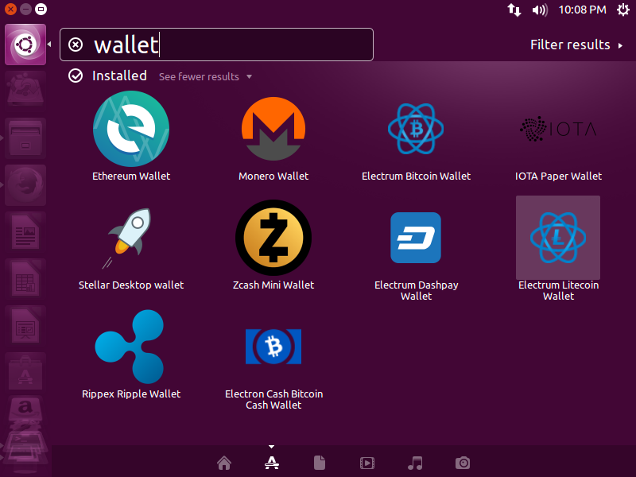

# cryptolive
CryptoLive ISO creator script
Designed to automatically build a remastered Ubuntu ISO that includes common crypto currency clients. This way you can burn it to a DVD and boot off of it from an offline computer. You are thereby able to generate wallets offline that are never saved anywhere or accessable from the internet, and are lost when you reboot. As long as you write down the private crypto seeds / keys, you have the only copy.

Password for user cryptolive is cryptoLive (note the capital L in the password)

